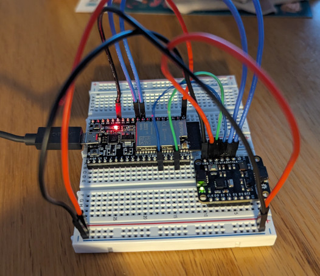

# Nexsense

This project explores the use of [ESP32forth](https://esp32forth.appspot.com/ESP32forth.html) on the Espressif ESP32 SoC with a [Nexus SENSE](https://github.com/Nexus-Electronics/SENSE-Getting-Started) sensor board. See [docs](docs) for details.
